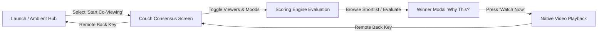

# ✨ Aura Vega TV — Living Room Ambient Hub & Co-Viewing Consensus Engine

[](https://amazonappdev2026.devpost.com)
[](https://developer.amazon.com/docs/fire-tv/)
[](https://reactnative.dev)
[](https://hermesengine.dev)
[](https://opensource.org/licenses/MIT)

> **"Build, Ship, Shape: Amazon Developer Hackathon 2026"**  
> **Target Platform:** Amazon Fire TV running **Vega OS**  
> **Application ID:** `com.auravega.tv`  
> **Runtime Target:** React Native for Vega (`react_native_kepler_4` & `react_native_kepler_headless_4`)

---

## 1. What Aura Vega Is

**Aura Vega TV** is an ambient living room command hub and deterministic co-viewing consensus engine built natively for Amazon Fire TV powered by **Vega OS**.

When idle, Aura transforms the television into an atmospheric, energy-conscious living room art canvas with time-of-day circadian lighting, environmental weather glance, and household presence. When it’s time to watch, Aura eliminates living room stalemates through a multi-viewer consensus engine that evaluates divergent preferences, critical ratings, and session context to pick a title that plays immediately.

---

## 2. The Problem: The 20-Minute Living Room Stalemate

Every evening, millions of living room co-viewers (couples, roommates, families) suffer from **decision fatigue**:
- Infinite scrolling across fragmented streaming apps takes **15 to 25 minutes**.
- Viewers have conflicting tastes: one wants Sci-Fi, another wants Comedy, and someone has an absolute veto on Horror.
- Current TV interfaces treat viewers as single profiles or force painful manual searching.
- Exhaustion leads to settling on background noise or abandoning viewing altogether.

---

## 3. The Solution: Couch Consensus

Aura Vega replaces endless browsing with **Couch Consensus**:
1. **Multi-Viewer Preference Aggregation:** Living room members are toggled with one remote click. Their preferred genres, moods, and vetoes are combined.
2. **Context-Aware Scoring:** Time-of-day, weather (rainy vs. sunny), and bedtime constraints factor into the ranking.
3. **Transparent Explainability ("Why This?"):** Viewers immediately see *why* a film won in plain English (e.g. *"Unanimous match across all active viewers • Fits late-night 2-hour window • 94% Rotten Tomatoes"*).
4. **Immediate Playback:** With a single press of **Select**, the winner plays full-screen via Vega's native W3C hardware media player.

---

## 4. Why Fire TV & Vega OS?

Fire TV is the center of the modern living room. Amazon's next-generation **Vega OS** provides:
- **Near-Instant Launch:** Powered by **Static Hermes Bytecode**, booting in under 800ms without JIT compilation overhead.
- **True Headless Background Execution:** `service.js` pre-computes recommendations while the TV is idle or in screensaver mode.
- **Hardware-Accelerated W3C Media:** Smooth 4K video playback with native caption rendering and hardware surface composition.
- **Native 10-Foot Focus & Recycler Carousel:** Vega Carousel v2 delivers 60fps horizontal navigation designed specifically for remote D-pads.

---

## 5. Core User Journey



1. **Launch:** TV boots into the Ambient Screen showing time, weather, and active household profiles.
2. **Enter Co-Viewing:** Navigate to **Couch Consensus** via D-pad.
3. **Select Viewers:** Toggle active co-viewers (e.g. Alice & Bob) and optional mood filters.
4. **Evaluate:** Press **⚡ Evaluate Consensus Now** or shortlist 3 titles.
5. **Inspect Winner:** The **Winner Modal** highlights the top match, score breakdown, and top 3 reasons.
6. **Watch Now:** Hit **Select** to immediately stream the film.

---

## 6. Architecture & System Design

```
aura-vega-tv/
├── index.js            # UI Application Entry Point (react_native_kepler_4)
├── service.js          # Headless Background Service (react_native_kepler_headless_4)
├── manifest.toml       # Vega OS Application Manifest & Permissions
├── metro.config.js     # Kepler Metro Compatibility Bundler Config
├── src/
│   ├── app/            # App Container & Stack Navigator
│   ├── components/     # FocusableCard, CaptionOverlay, AmbientParticle
│   ├── context/        # ConsensusContext (State & Dispatch)
│   ├── data/           # 12-Item Curated Media Catalog
│   ├── engine/         # ScoringEngine & 2D Spatial FocusEngine
│   ├── headless/       # ContentPersonalizationHeadlessService
│   ├── screens/        # Ambient, Consensus, VideoPlayer, Settings
│   ├── services/       # MediaDataService, WeatherService
│   ├── styles/         # 10-Foot Design Tokens (colors, typography, safe zones)
│   └── types/          # Strict TypeScript Contracts
└── tst/                # 11 Jest Test Suites (55 automated tests)
```

---

## 7. Deterministic Scoring Engine

The consensus engine evaluates every candidate against active co-viewers and environmental context using a normalized multi-factor formula:

$$S_{\text{total}} = 0.35 \cdot \text{Affinity} + 0.25 \cdot \text{Quality} + 0.25 \cdot \text{Context} + 0.15 \cdot \text{Runtime} - \text{Penalty}$$

- **Affinity (35%):** Group satisfaction across preferred genres and moods.
- **Quality (25%):** Normalized IMDb ($0\text{–}10 \times 10$) and Rotten Tomatoes ($0\text{–}100$).
- **Context (25%):** Time-of-day fit, atmospheric weather bonus (rainy vs. sunny), session mood overrides.
- **Runtime (15%):** Adherence to bedtime constraints (steep $1.2\times$ decay when over limit).
- **Veto Penalty:** A $-40$ penalty per disliking viewer. If a majority dislikes a genre, `isVetoed: true` caps the score at $\le 30\%$.
- **Strict Tie-Breaker:** Total Score $\rightarrow$ Affinity $\rightarrow$ Quality $\rightarrow$ Alphabetical title.

---

## 8. Amazon & Vega Technologies Used

| Amazon / Vega Technology | Role in Aura Vega TV |
| :--- | :--- |
| **Vega OS SDK 0.24** | Official operating system target and manifest specification (`manifest.toml`). |
| **`@amazon-devices/react-native-kepler`** | Vega React Native 0.83 runtime core. |
| **`@amazon-devices/react-native-w3cmedia`** | Native hardware `KeplerVideoSurfaceView` and headless `VideoPlayer` pipeline. |
| **`@amazon-devices/vega-carousel`** | TV Carousel v2 with `CarouselItemDataAdapter` for 60fps horizontal shelf scrolling. |
| **`@amazon-devices/react-navigation__stack`** | Vega-certified TV stack navigation with freeze and screen optimization. |
| **`@amazon-devices/kepler-cli-platform`** | Metro bundler plugin and Static Hermes bytecode compiler. |
| **`@amazon-devices/kepler-a11y-settings-interface-turbo`** | Native accessibility bridge for system caption preferences. |

---

## 9. Remote Keybindings (10-Foot Remote Navigation)

| Remote Control Key | In-App Action |
| :--- | :--- |
| **D-Pad Directional (▲ ▼ ◄ ►)** | Spatial focus traversal with 3px cyan focus ring (`#00E5FF`) and 1.05 scale |
| **D-Pad Center (Select / Enter)** | Activate focused control, toggle viewer, trigger consensus, watch trailer |
| **Media Play / Pause** | Toggle video playback in full-screen player |
| **Back Button (Escape)** | Dismiss modal, exit video player, or return to Ambient Hub |

---

## 10. Setup, Build & Test Instructions

### Prerequisites
- Node.js 18+ (tested on Node.js 20 & 22)
- npm 9+

### 1. Install Dependencies
```bash
npm install
```

### 2. Run TypeScript Typecheck
```bash
npm run typecheck
```

### 3. Run Automated Test Suite (11 Suites / 55 Tests)
```bash
npm test
```

### 4. Build Release Metro & Static Hermes Bundles
```bash
npm run bundle:release
```
Generates release artifacts in `build/lib/rn-bundles/Release/`:
- `index.bundle` (Metro JS bundle)
- `index.bundle.map` (Source map)
- Static Hermes bytecode compiled via `hermesc.exe`
- Asset bundle copies

---

## 11. 3-Minute Demo Sequence

1. **[0:00–0:20] Ambient Hub:** Showcases idle TV state with circadian time-of-day clock, simulated rainy weather, and household voter presence.
2. **[0:20–0:40] Enter Couch Consensus:** Press **Select** to enter the recommendation interface.
3. **[0:40–1:15] Select Viewers & Mood:** Toggle co-viewers (Ronak + Family). Watch candidate match badges recalculate dynamically.
4. **[1:15–1:45] Evaluate Consensus:** Press **⚡ Evaluate Consensus Now**.
5. **[1:45–2:15] "Why This?" Inspection:** The Winner Modal pops up showing *Interstellar* (88% Match), group affinity breakdown, and clear explanations.
6. **[2:15–2:50] Instant Watch:** Press **▶ Watch Now**. The native Vega video player launches immediately with custom TV playback controls and closed captions.
7. **[2:50–3:00] Return:** Press **Back** to return to Consensus and the Ambient Hub.

---

## 12. Verification Boundaries & Platform Limitations

- **Metro & Hermes Bytecode Compilation:** 100% verified on host via official `@amazon-devices/kepler-cli-platform` and `hermesc.exe`.
- **Logic & Scenario Tests:** 100% pass across 55 unit tests (covering 7 conflict scenarios, focus routing, headless caching, and caption styling).
- **Physical Device Boundary:** An on-device or desktop emulator is not included in the Windows release of the Amazon developer SDK (`run-vega` is marked by Amazon as an unimplemented placeholder). Final hardware validation requires deployment via ADB to a physical Vega developer device.

---

## 13. License

Distributed under the **MIT License**. See `LICENSE` for details.
