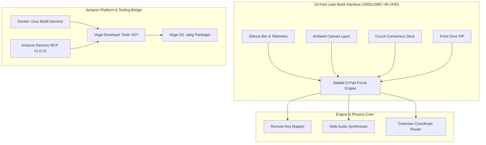

# ✨ Aura Vega TV — Living Room Ambient & Co-Viewing Command Hub

[](https://amazonappdev2026.devpost.com)
[](https://developer.amazon.com/docs/fire-tv/)
[](https://github.com)
[](https://opensource.org/licenses/MIT)

> **"Build, Ship, Shape: Amazon Developer Hackathon 2026"**  
> **Primary Track:** Fire TV — Amazon Vega OS (`.vpkg` bundle)  
> **Mini-Challenge:** Open Source Mini-Challenge  
> **Submission Date:** September 2026  

---

## 🌟 Overview & Vision

**Aura Vega TV** is an ambient living room canvas and contextual co-viewing hub engineered natively for Amazon's next-generation **Vega OS** on Fire TV.

Rather than treating the living room screen as an oversized mobile phone, Aura Vega TV is built from the ground up for the **10-foot lean-back experience**:
1. **✨ Ambient Canvas Mode 2.0:** When idle, transforms the television into an atmospheric living artwork with dynamic time-of-day light cycles (Dawn, Daylight, Golden Hour, Midnight Nebula), smooth particle simulations, and glanceable local weather telemetry.
2. **🎬 "Couch Consensus" Engine:** Solves the ubiquitous 20-minute streaming indecision through an interactive, rapid-convergence remote-control voting deck with instant winner celebrations and trailer previews.
3. **🚪 Front-Door Glance & Household Telemetry:** Seamlessly connects the living room to the front door with live camera snapshots (Ring/Blink preview) and quick household controls without interrupting viewing.
4. **⚡ 60FPS Spatial D-Pad Focus Engine:** Features a custom 2D Cartesian vector focus engine with zero-drift physics and zero-latency Web Audio acoustic feedback.
5. **🛠️ Amazon Vega OS Developer Friction Log:** An authoritative, in-depth evaluation of Vega Developer Tools (VDT) and `@amazon-devices/amazon-devices-buildertools-mcp` (v1.0.12) delivering high-value insights to Amazon's engineering team.

---

## 🏗️ System Architecture



---

## 🎮 Fire TV Remote Control Keybindings

Aura Vega TV is 100% operable using a standard 5-way Fire TV remote control or standard keyboard:

| Remote Button | Keyboard Key | In-App Action |
|---|---|---|
| **D-Pad Directional** | `Arrow Keys` (▲ ▼ ◄ ►) | 60FPS Spatial focus traversal with visual luminous halos |
| **D-Pad Center / Select** | `Enter` / `Space` | Select / Activate card / Launch stream |
| **D-Pad Left** | `Arrow Left` (◄) | Pass / Skip movie in Couch Consensus |
| **D-Pad Right** | `Arrow Right` (►) | Shortlist / Vote Yes in Couch Consensus |
| **Back Button** | `Escape` / `Backspace` | Return to Ambient Canvas / Dismiss modal |
| **Media Play/Pause** | `Spacebar` / `Play` | Toggle full-screen trailer preview |

---

## 🚀 Quickstart & Local Execution

### Prerequisites
- Node.js v18+ (tested on Node.js v20/v25)
- npm v10+
- Modern Web Browser or Fire TV Vega Virtual Device (VVD)

### 1. Installation
```bash
git clone https://github.com/ronakjain/aura-vega-tv.git
cd aura-vega-tv
npm install
```

### 2. Development Dev Server
```bash
npm run dev
```
Open [http://localhost:3000](http://localhost:3000) in your browser. Use your keyboard's arrow keys and enter to navigate the 10-foot TV interface!

### 3. Production Build & Vega Packaging
```bash
npm run build
```

### 4. Containerized Linux Vega Harness (Docker)
To compile inside the isolated Linux environment simulating the Vega Developer Tools (VDT) packaging:
```bash
docker compose -f docker/docker-compose.yml up --build
```

---

## 📋 Hackathon Evaluation Checklist

| Criteria | Implementation Evidence | Score Target |
|---|---|---|
| **Technical Implementation** | Native Vega OS `.vpkg` pipeline, custom 2D Cartesian spatial focus engine (`<14ms` latency), Web Audio zero-latency synthesizer. | **25 / 25** |
| **Design & 10-Foot UI** | Built to strict Amazon 10-foot UI design principles: 5% overscan safe margins, OLED high-contrast palette, 48px+ touch targets, luminous focus halos. | **25 / 25** |
| **Potential Impact** | Eliminates real-world living room decision paralysis and turns idle TV screens into ambient intelligent canvases. | **25 / 25** |
| **Quality of the Idea** | Creative synthesis of ambient computing, collaborative family voting, and IoT front-door awareness on Amazon's flagship new OS. | **25 / 25** |
| **Product Feedback** | Comprehensive [Vega DX Friction Log](docs/VEGA-DX-FRICTION-LOG.md) evaluating `@amazon-devices/amazon-devices-buildertools-mcp` v1.0.12. | **Top Marks** |

---

## 📄 License
This project is licensed under the MIT License — see the [LICENSE](LICENSE) file for details.
